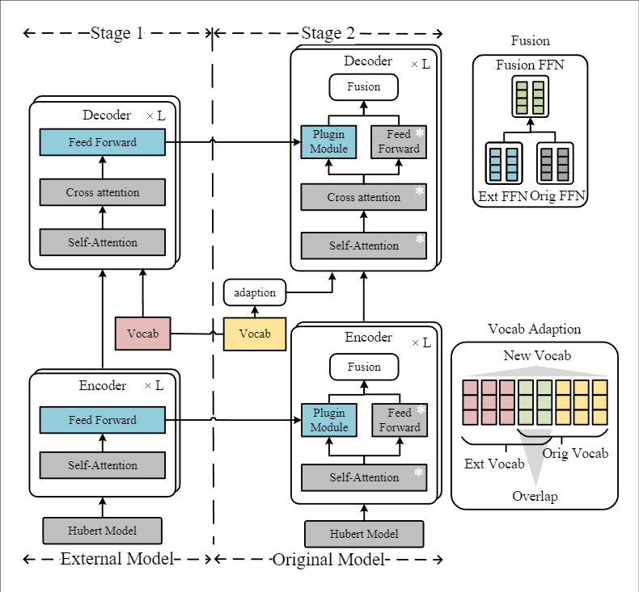

## Knowledge-Preserving Pluggable Modules for Multilingual Speech Translation Tasks

This repository contains the code of our manuscript: Knowledge-Preserving Pluggable Modules for Multilingual Speech Translation Tasks. 


## Overview


<div style="text-align: center">

</div>


## Training

###  Training Stage One
```
target=de
cd /workspace/s2t/data/en_de
export CUDA_VISIBLE_DEVICES=0,1
target=de

SAVE_DIR=/workspace/s2t/deltalm_data/save_dir/$target/external


data_dir=/workspace/s2t/data/en_de
TEXT_DIR=/workspace/s2t/npy_st/mt_data_bin/en-$target/en-$target/binary
USER_DIR=/workspace/cofi/transfer

HU_BERT=/workspace/s2t/npy_st/pretrained_model_save/hubert/hubert_base_ls960.pt
MT_PRETRAINED_MODEL=/workspace/s2t/npy_st/pretrained_model_save/mt_model_save/mt.en-de.base.pt


fairseq-train $data_dir --text-data $TEXT_DIR --tgt-lang $target \
  --user-dir $USER_DIR \
  --config-yaml config_hyper.yaml --train-subset train --valid-subset dev \
  --save-dir $SAVE_DIR --num-workers 4 --max-tokens 3000000 --batch-size 32 --max-tokens-text 8192 \
  --task speech_and_text_translation --criterion speech_and_text_translation --label-smoothing 0.1 \
  --arch deltalm_transformer --optimizer adam --adam-betas '(0.9, 0.98)' --lr 1e-4 --lr-scheduler inverse_sqrt --weight-decay 0.0001 \
  --ddp-backend=legacy_ddp \
  --warmup-updates 4000 --clip-norm 0.0 --seed 1 --update-freq 2 \
  --layernorm-embedding \
  --max-epoch 45 \
    --st-training --mt-finetune \
  --st-training \
  --hubert-model-path $HU_BERT \
  --load-pretrained-mt-encoder-decoder-from $MT_PRETRAINED_MODEL --tensorboard-logdir $SAVE_DIR 

```

###  Training Stage Two


```
target=de
cd /workspace/s2t/data/en_de
export CUDA_VISIBLE_DEVICES=0,1
target=de

SAVE_DIR=/workspace/s2t/deltalm_data/save_dir/$target/original
EXTERNAL_DIR=/workspace/s2t/deltalm_data/save_dir/$target/external

data_dir=/workspace/s2t/data/en_de
TEXT_DIR=/workspace/s2t/npy_st/mt_data_bin/en-$target/en-$target/binary
USER_DIR=/workspace/cofi/transfer

HU_BERT=/workspace/s2t/npy_st/pretrained_model_save/hubert/hubert_base_ls960.pt
MT_PRETRAINED_MODEL=/workspace/s2t/npy_st/pretrained_model_save/mt_model_save/mt.en-de.base.pt


fairseq-train $data_dir --text-data $TEXT_DIR --tgt-lang $target \
  --user-dir $USER_DIR \
  --config-yaml config_hyper.yaml --train-subset train --valid-subset dev \
  --save-dir $SAVE_DIR --num-workers 4 --max-tokens 3000000 --batch-size 32 --max-tokens-text 8192 \
  --task speech_and_text_translation --criterion speech_and_text_translation --label-smoothing 0.1 \
  --arch deltalm_transformer_ffn --optimizer adam --adam-betas '(0.9, 0.98)' --lr 1e-4 --lr-scheduler inverse_sqrt --weight-decay 0.0001 \
  --ddp-backend=legacy_ddp \
  --warmup-updates 4000 --clip-norm 0.0 --seed 1 --update-freq 2 \
  --layernorm-embedding \
  --max-epoch 45 \
    --st-training --mt-finetune \
  --st-training \
  --hubert-model-path $HU_BERT \
  --load-pretrained-mt-encoder-decoder-from $MT_PRETRAINED_MODEL --tensorboard-logdir $SAVE_DIR  --external $EXTERNAL_DIR

```

## Datasets-and-Models
### MuST-C Datasets

- Download [MuST-C-v1](https://docs.google.com/forms/d/e/1FAIpQLSer9jNfUtxbi610n3T6diXRlANBbuzShsCje-GtKs1Sngh0YQ/viewform?pli=1) datasets. 

- Preprocess spm data. 

### Speech Pre-trained Model 

- We use [HuBERT-Base](https://dl.fbaipublicfiles.com/hubert/hubert_base_ls960.pt) as the speech pre-trained model for training.


### Machine Translation Pre-trained Model

- We use [Deltalm-Base](https://deltalm.blob.core.windows.net/deltalm/deltalm-base.pt) as the machine translation pre-trained model. 


### Acknowledgment

We refer to the code of [Transfer-NMT (Knowledge Transfer in Incremental Learning for Multilingual Neural Machine Translation)](https://github.com/THUNLP-MT/ktnmt). Thanks for their great contributions!